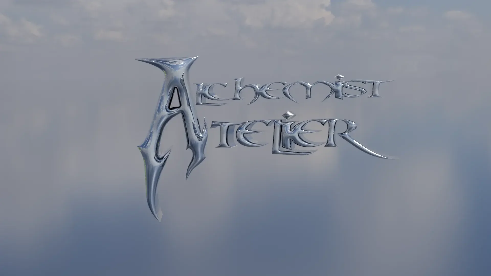

# AETHER Brand Assets

**Version:** 4.0  
**Generated:** 2025-12-28 21:58  
**Total Assets:** 45

## Overview

This package contains all AETHER brand assets, consolidated and optimized for web use:
- All images converted to **WebP** format (optimal compression + quality)
- **SVG** files preserved for vector graphics
- **Duplicates removed** via perceptual hashing
- **Git-friendly** lowercase, hyphenated filenames

## Categories

| Category | Count | Description |
|----------|-------|-------------|
| characters | 3 | Characters assets |
| concept-art | 2 | Concept Art assets |
| environments | 7 | Environments assets |
| experiences | 1 | Experiences assets |
| founder-story | 4 | Founder Story assets |
| logos | 5 | Logos assets |
| misc | 3 | Misc assets |
| portfolio | 5 | Portfolio assets |
| production | 1 | Production assets |
| set-design | 4 | Set Design assets |
| ui-elements | 10 | Ui Elements assets |

## Usage

### Import in TypeScript/JavaScript
```typescript
import manifest from './manifest.json';
import {{ getAsset, getAssetsByCategory, ASSET_IDS }} from './types';

// Get specific asset
const logo = getAsset(manifest, ASSET_IDS.PHYGITAL_LOGO_TEXT);

// Get all logos
const allLogos = getAssetsByCategory(manifest, 'logos');
```

### HTML Usage
```html

```

### CSS Usage
```css
.hero {{
  background-image: url('./environments/site-collage.webp');
}}
```

## Claude Integration

When working with Claude, reference assets using their IDs from `manifest.json`:

```
"Use the asset with id: phygital-logo-text for the header"
```

Claude can query `manifest.json` to find the exact path and metadata.

## File Structure

```
AETHER_Brand_Assets/
├── manifest.json          # Complete asset manifest
├── types.ts              # TypeScript types & helpers
├── README.md             # This file
├── characters/                 # 3 assets
├── concept-art/                 # 2 assets
├── environments/                 # 7 assets
├── experiences/                 # 1 assets
├── founder-story/                 # 4 assets
├── logos/                 # 5 assets
├── misc/                 # 3 assets
├── portfolio/                 # 5 assets
├── production/                 # 1 assets
├── set-design/                 # 4 assets
├── ui-elements/                 # 10 assets
```

## Brand Guidelines

- **Primary Colors:** Reference AETHER brand styling document
- **Windows 95 Aesthetic:** Retro-futuristic UI design language
- **Typography:** System fonts with pixel-art accents

---
*AETHER - Democratizing Transformative Experiences*
